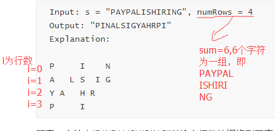

### 6.ZigZag Conversion

Medium

The string `"PAYPALISHIRING"` is written in a zigzag pattern on a given number of rows like this: (you may want to display this pattern in a fixed font for better legibility)

```
P   A   H   N
A P L S I I G
Y   I   R
```

And then read line by line: `"PAHNAPLSIIGYIR"`

Write the code that will take a string and make this conversion given a number of rows:

```
string convert(string s, int numRows);
```

**Example 1:**

```
Input: s = "PAYPALISHIRING", numRows = 3
Output: "PAHNAPLSIIGYIR"
```

**Example 2:**

```
Input: s = "PAYPALISHIRING", numRows = 4
Output: "PINALSIGYAHRPI"
Explanation:

P     I    N
A   L S  I G
Y A   H R
P     I
```

题意：字符串“PAYPALISHIRING”以给定行数的锯齿形图案（Z）写成，然后逐行阅读：“PAHNAPLSIIGYIR”
编写将采用字符串的代码，并将此转换指定为多行。



我认为应该是个找规律题，以给定的数字numRows，以sum=numRows+numRows-2数字字符为一组，第一行和最后一行字符特殊处理，可以按**j*sum+i**来寻找，中间的行字符的规律是，找到开始的第一个，比如A（1,0），在原始字符串中他的位置加4为下一个该输出的字符L，同理第二组输出S后，原始位置加4为I...........等到i=2时，第一个字符要加2才是下一个字符的位置。

加4，加2 这个规律应该很简单可以找得到

以上就是我找到的规律.

好吧，这就是我解这道题的想法，可能你们看不懂，其实，我也是稀里糊涂的给过了，语言表述还有待加强。


```c++
class Solution {
public:
    string convert(string s, int numRows) {
        int len=s.length();
        int sum=numRows+numRows-2;
        string p;
        # 这个开始没有想到，提交后看了错误样例加上去的
        if(numRows==1)
            return s;
        int flag=0;
        for(int i=0;i<numRows;i++)
        {
            # 第一组第一竖列的字符
            p.insert(flag++,1,s[i]);
            int j=0;
            while(j*sum+i<len)
            {
                # 排除第一行和最后一行和超界的
                if(i!=0&&i!=numRows-1&&(j*sum+i+(sum-2*i))<len)
                {
                    p.insert(flag++,1,s[j*sum+i+(sum-2*i)]);
                }  
                j++;
                if(j*sum+i<len)
                p.insert(flag++,1,s[j*sum+i]);
                    
            }
        }
        return p;
        
    }
};
```


思路一样，这个讲的比较容易懂https://www.cnblogs.com/TenosDoIt/p/3738693.html