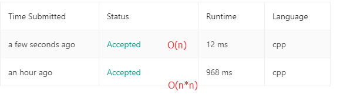

## [Container With Most Water](https://leetcode.com/problems/container-with-most-water/)

Given *n* non-negative integers *a1*, *a2*, ..., *an* , where each represents a point at coordinate (*i*, *ai*). *n*vertical lines are drawn such that the two endpoints of line *i* is at (*i*, *ai*) and (*i*, 0). Find two lines, which together with x-axis forms a container, such that the container contains the most water.

**Note:** You may not slant the container and *n* is at least 2.

 


The above vertical lines are represented by array [1,8,6,2,5,4,8,3,7]. In this case, the max area of water (blue section) the container can contain is 49.

 

**Example:**

```
Input: [1,8,6,2,5,4,8,3,7]
Output: 49
```

题目大意：求出所给的序列中，两个序列所能围出的最大面积。

C++版：

暴力解法：时间复杂度差强人意（O(n*n)）

```c++
class Solution {
public:
    int maxArea(vector<int>& height) {
        int len = height.size();
        int sum = -1;
        for (int i =0 ;i<len;i++)
        {
            for(int j=i+1;j<len;j++)
            {
                int k =height[i]>height[j]?height[j]:height[i];
                sum = sum>k*(j-i)?sum:k*(j-i);
            }
        }
        return sum;
    }
};
```

这是一个O(n)的解法：

参考:[Leetcode-第十一题Container With Most Water](https://blog.csdn.net/starstar1992/article/details/53894005)

```c++
class Solution {
public:
    int maxArea(vector<int>& height) {
        int len = height.size();
        int sum = -1;
        for(int i=0,j=len-1;i!=j&&i<j;)
        {
            int sum1=(j-i)*(height[j]>height[i]?height[i++]:height[j--]);
            sum = sum1>sum?sum1:sum;
        }
        return sum;
    }
};
```

这是两种解法的时间对比，很明显：



Python3版：

```python
class Solution:
    def maxArea(self, height):
        """
        :type height: List[int]
        :rtype: int
        """
        i = 0
        j = len(height)-1
        summ = -1
        while i<j:
            summ = max(summ,(j-i)*(min(height[i],height[j])))
            if height[i] > height[j]:j-=1
            else : i+=1
        return summ
            
```

